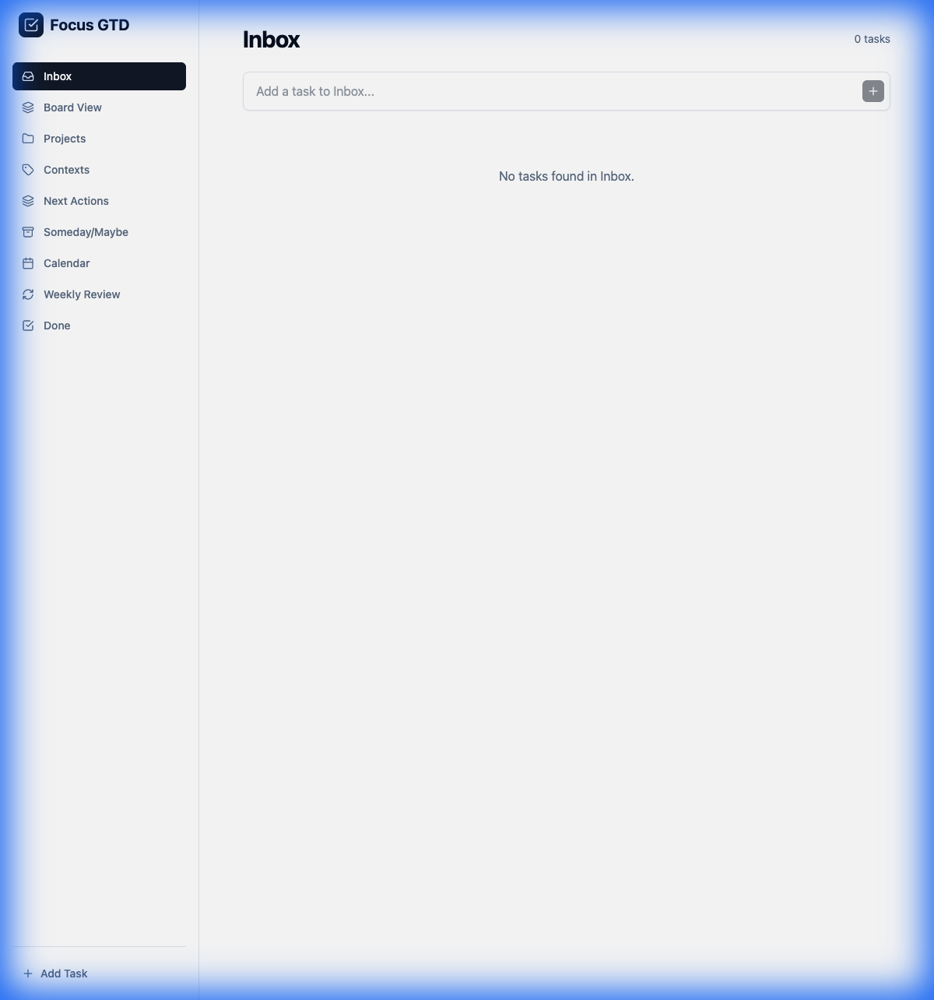
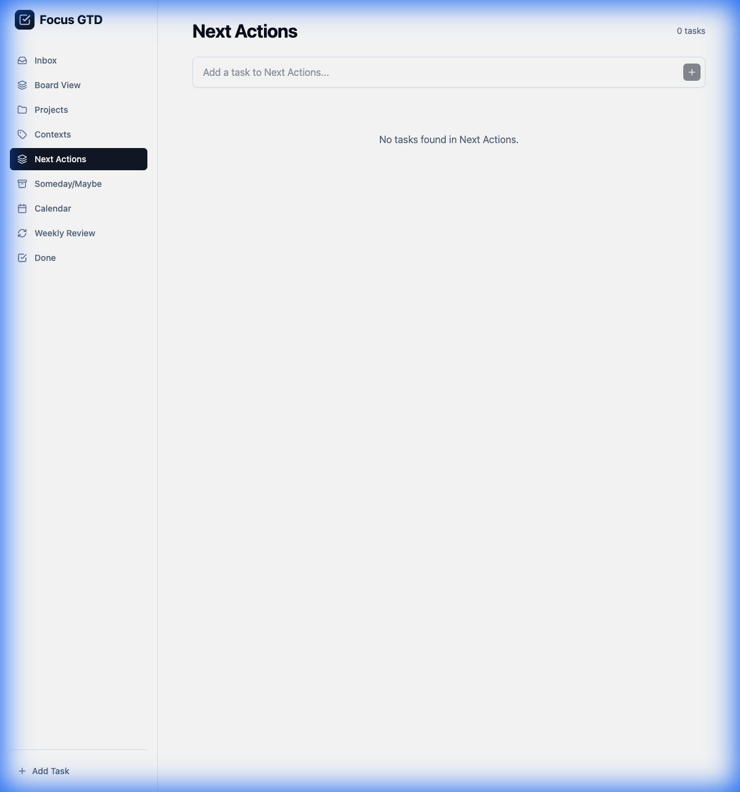
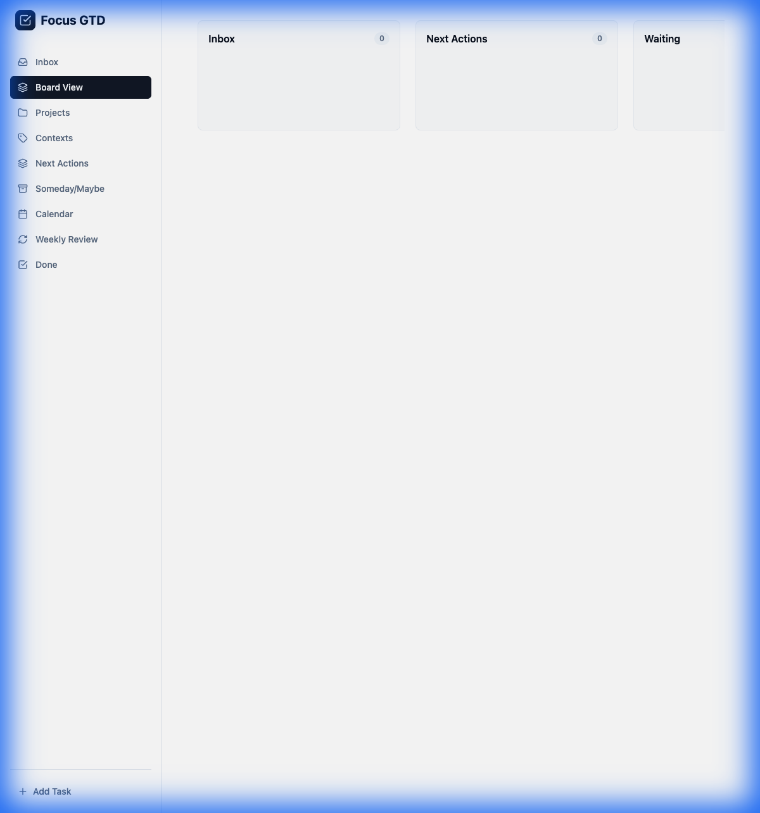
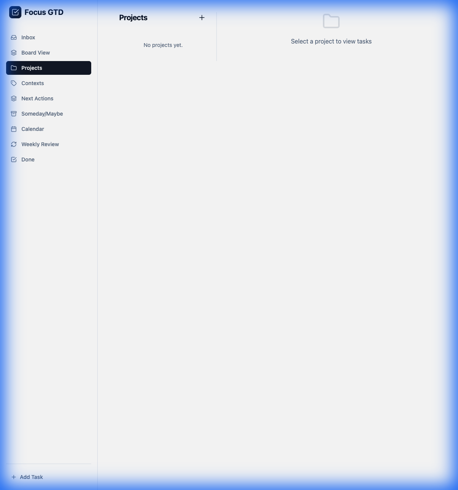
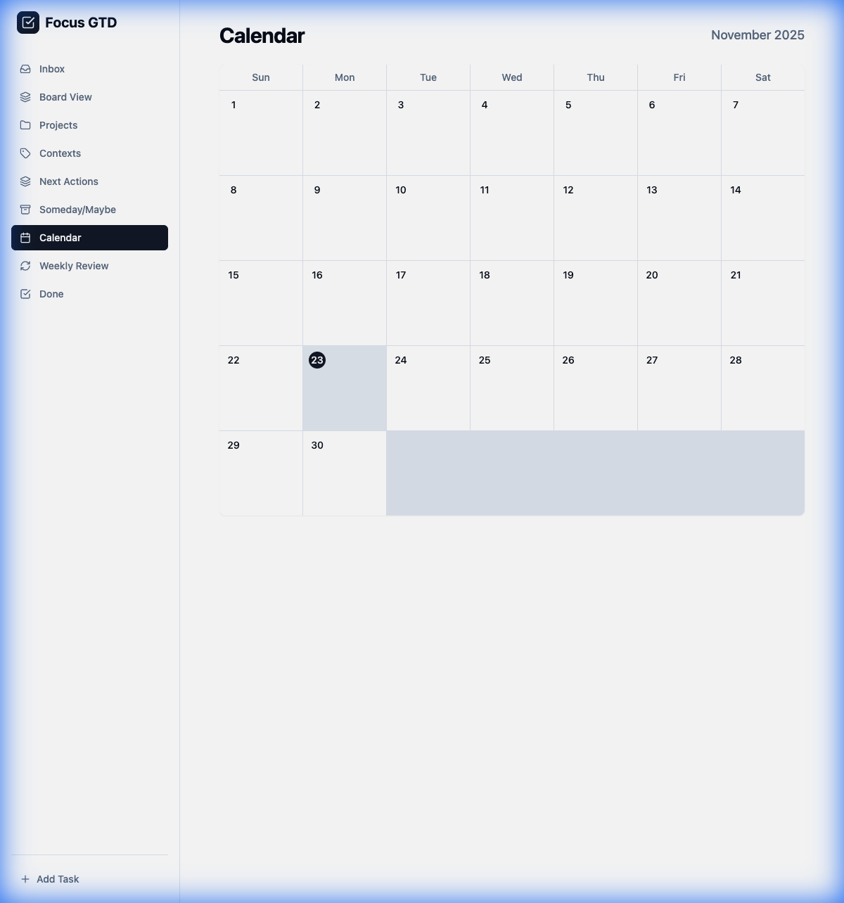
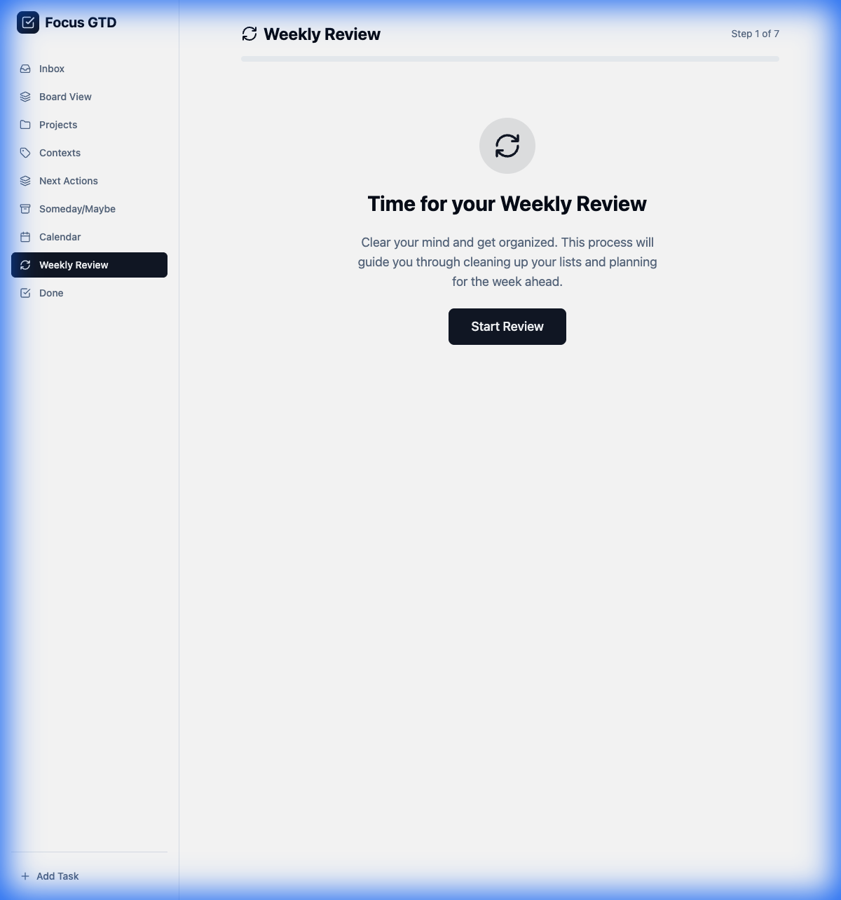

# Focus GTD

A Getting Things Done (GTD) compliant to-do list application built with React, TypeScript, and Vite.

## Features

- **GTD Workflow**: Capture, Clarify, Organize, Reflect, Engage.
- **Inbox**: Quick capture for all your thoughts and tasks.
- **Projects**: Organize multi-step tasks into projects with custom colors.
- **Contexts**: Filter tasks by context (e.g., @home, @work).
- **Weekly Review**: A guided wizard to help you review your system weekly.
- **Views**:
  - **List View**: Standard list for Inbox, Next Actions, etc.
  - **Board View**: Kanban-style drag-and-drop board.
  - **Calendar View**: Schedule and view tasks on a calendar.
- **Local First**: Data is stored locally in `data.json`.

## Screenshots

### Inbox & Next Actions
| Inbox | Next Actions |
|-------|--------------|
|  |  |

### Organization
| Kanban Board | Projects |
|--------------|----------|
|  |  |

### Planning
| Calendar | Weekly Review |
|----------|---------------|
|  |  |

## Tech Stack

- React
- TypeScript
- Vite
- Tailwind CSS
- Zustand (State Management)
- @dnd-kit (Drag and Drop)
- date-fns
- Electron (Desktop App)

## Getting Started

### Running the Desktop App

1.  **Install Dependencies**:
    ```bash
    npm install
    ```

2.  **Launch the Desktop App**:
    ```bash
    npm run dev
    ```
    This will start the Electron desktop application directly on your macOS or Linux system.

3.  **Build for Distribution** (Optional):
    ```bash
    npm run build
    ```
    This creates a distributable version of the app.

## Data Persistence

Tasks and projects are saved to `data.json` in your application data directory:
- **macOS**: `~/Library/Application Support/focus-gtd/data.json`
- **Linux**: `~/.config/focus-gtd/data.json`

This file can be synced across devices using tools like Syncthing.

## Testing

Run the test suite:
```bash
npm test
```

The project includes:
- Unit tests for the Zustand store
- Component tests for UI elements
- Accessibility tests with vitest-axe
- Weekly Review workflow tests

